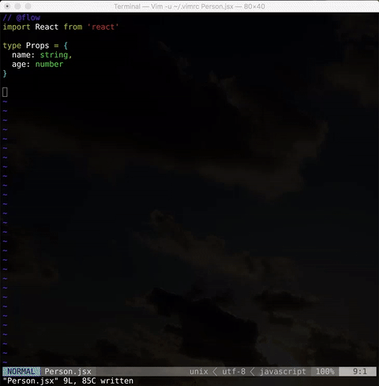
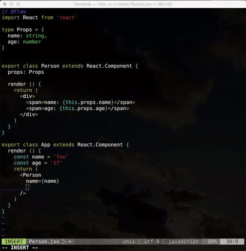

# vim-flood

vim-flood is plugin for [Facebook Flow](https://flowtype.org/).

Autocompletion.

Type check.

# Features

- Autocompletion
  - omni-completion(Default)
  - async completion via Vim's `job` and `channel`
- Type check
  - Flow check
  - Flow content-check
- Defeinition
  - Gets the definition location of a variable or property
- FindRefs
  - Gets the reference locations of a variable or property
- Imports
  - Get names of all modules imported by one or more given modules
- Start
  - Starts a Flow server
- Status
  - Flow server status
- Stop
  - Stops a Flow server
- Suggest
  - Shows type annotation suggestions for given files
- Version
  - Print version information
- Local Node package
  - vim-flood does not need flow global insatalled

## License

New BSD License
